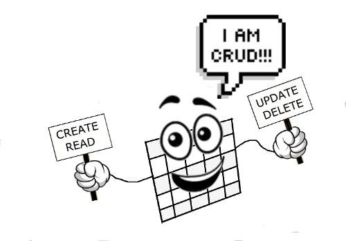
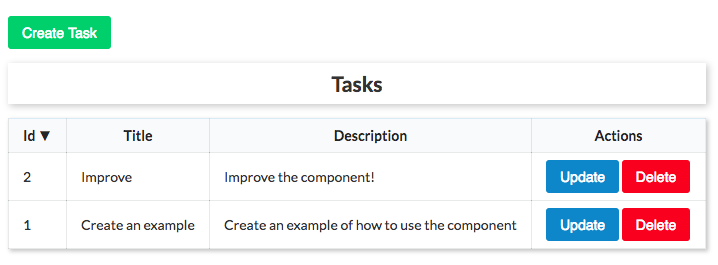
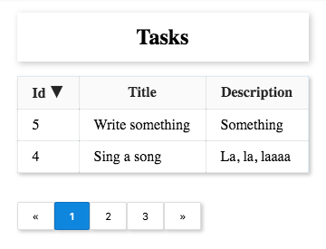

# React CRUD Table
A table that includes all the CRUD operations.



[](https://www.npmjs.com/package/react-crud-table)
[](https://github.com/xvicmanx/react-crud-table/blob/master/LICENSE)
[](https://GitHub.com/xvicmanx/react-crud-table/issues/)
[](https://GitHub.com/xvicmanx/react-crud-table/pull/)


## Table of Contents

* [Introduction](#introduction)
* [Features](#features)
* [Setup](#setup)
* [Examples](#examples)
* [Components Properties](#components-properties)
* [Development](#development)
* [Contributing](#contributing)
* [License](#license)
* [Comments](#comments)


## Introduction
  A table built in react that includes all the CRUD (Create, Read, Update, Delete) operations.

## Features

* CRUD operations
* Pagination
* Query rules builder to filter items.
* Sort items by a given property when clicking the column header.

## Setup

```shell 
$ npm install react-crud-table --save
```

Include the css in [CRUD Table style](https://raw.githubusercontent.com/xvicmanx/react-crud-table/master/src/index.css) in your project.

## Examples

There is no better way to learn than from examples. We've created some examples of the basic usage of the component.

* [Basic Example](#basic-example)
* [Pagination Example](#pagination-example)

### Basic Example
This example shows the basics CRUD (Create, Read, Update, and Delete) and sorting operations.

[In Code Sandbox](https://codesandbox.io/s/6v8qm0jm43)

[Link to the css](https://raw.githubusercontent.com/xvicmanx/react-crud-table/master/src/index.css)

```shell 
$ npm install react-crud-table --save
```

```js
import React from 'react';
import ReactDOM from 'react-dom';
import CRUDTable,
{
  Fields,
  Field,
  CreateForm,
  UpdateForm,
  DeleteForm,
} from 'react-crud-table';

// Component's Base CSS
import './index.css';

const DescriptionRenderer = ({ field }) => <textarea {...field} />;

let tasks = [
  {
    id: 1,
    title: 'Create an example',
    description: 'Create an example of how to use the component',
  },
  {
    id: 2,
    title: 'Improve',
    description: 'Improve the component!',
  },
];

const SORTERS = {
  NUMBER_ASCENDING: mapper => (a, b) => mapper(a) - mapper(b),
  NUMBER_DESCENDING: mapper => (a, b) => mapper(b) - mapper(a),
  STRING_ASCENDING: mapper => (a, b) => mapper(a).localeCompare(mapper(b)),
  STRING_DESCENDING: mapper => (a, b) => mapper(b).localeCompare(mapper(a)),
};

const getSorter = (data) => {
  const mapper = x => x[data.field];
  let sorter = SORTERS.STRING_ASCENDING(mapper);

  if (data.field === 'id') {
    sorter = data.direction === 'ascending' ?
      SORTERS.NUMBER_ASCENDING(mapper) : SORTERS.NUMBER_DESCENDING(mapper);
  } else {
    sorter = data.direction === 'ascending' ?
      SORTERS.STRING_ASCENDING(mapper) : SORTERS.STRING_DESCENDING(mapper);
  }

  return sorter;
};


let count = tasks.length;
const service = {
  fetchItems: (payload) => {
    let result = Array.from(tasks);
    result = result.sort(getSorter(payload.sort));
    return Promise.resolve(result);
  },
  create: (task) => {
    count += 1;
    tasks.push({
      ...task,
      id: count,
    });
    return Promise.resolve(task);
  },
  update: (data) => {
    const task = tasks.find(t => t.id === data.id);
    task.title = data.title;
    task.description = data.description;
    return Promise.resolve(task);
  },
  delete: (data) => {
    const task = tasks.find(t => t.id === data.id);
    tasks = tasks.filter(t => t.id !== task.id);
    return Promise.resolve(task);
  },
};

const styles = {
  container: { margin: 'auto', width: 'fit-content' },
};

const Example = () => (
  <div style={styles.container}>
    <CRUDTable
      caption="Tasks"
      fetchItems={payload => service.fetchItems(payload)}
    >
      <Fields>
        <Field
          name="id"
          label="Id"
          hideInCreateForm
          readOnly
        />
        <Field
          name="title"
          label="Title"
          placeholder="Title"
        />
        <Field
          name="description"
          label="Description"
          render={DescriptionRenderer}
        />
      </Fields>
      <CreateForm
        title="Task Creation"
        message="Create a new task!"
        trigger="Create Task"
        onSubmit={task => service.create(task)}
        submitText="Create"
        validate={(values) => {
          const errors = {};
          if (!values.title) {
            errors.title = 'Please, provide task\'s title';
          }

          if (!values.description) {
            errors.description = 'Please, provide task\'s description';
          }

          return errors;
        }}
      />

      <UpdateForm
        title="Task Update Process"
        message="Update task"
        trigger="Update"
        onSubmit={task => service.update(task)}
        submitText="Update"
        validate={(values) => {
          const errors = {};

          if (!values.id) {
            errors.id = 'Please, provide id';
          }

          if (!values.title) {
            errors.title = 'Please, provide task\'s title';
          }

          if (!values.description) {
            errors.description = 'Please, provide task\'s description';
          }

          return errors;
        }}
      />

      <DeleteForm
        title="Task Delete Process"
        message="Are you sure you want to delete the task?"
        trigger="Delete"
        onSubmit={task => service.delete(task)}
        submitText="Delete"
        validate={(values) => {
          const errors = {};
          if (!values.id) {
            errors.id = 'Please, provide id';
          }
          return errors;
        }}
      />
    </CRUDTable>
  </div>
);

Example.propTypes = {};

ReactDOM.render(
  <Example />,
  document.getElementById('root')
);
```




### Pagination Example
This simple example illustrates how to use the pagination component.
[In Code Sandbox](https://codesandbox.io/s/jlr86lvv8v)

[Link to the css](https://raw.githubusercontent.com/xvicmanx/react-crud-table/master/src/index.css)

```js
  import React from "react";
import ReactDOM from "react-dom";
import CRUDTable, { Fields, Field, Pagination } from "react-crud-table";
// Component's Base CSS
import "./index.css";

const styles = {
  container: { margin: "auto", width: "fit-content" }
};

let tasks = [
  {
    id: 1,
    title: "Create an example",
    description: "Create an example of how to use the component"
  },
  {
    id: 2,
    title: "Improve",
    description: "Improve the component!"
  },
  {
    id: 3,
    title: "Create a pagination example",
    description: "Yeah!! It will be created."
  },
  {
    id: 4,
    title: "Sing a song",
    description: "La, la, laaaa"
  },
  {
    id: 5,
    title: "Write something",
    description: "Something"
  }
];

const SORTERS = {
  NUMBER_ASCENDING: mapper => (a, b) => mapper(a) - mapper(b),
  NUMBER_DESCENDING: mapper => (a, b) => mapper(b) - mapper(a),
  STRING_ASCENDING: mapper => (a, b) => mapper(a).localeCompare(mapper(b)),
  STRING_DESCENDING: mapper => (a, b) => mapper(b).localeCompare(mapper(a))
};

const getSorter = data => {
  const mapper = x => x[data.field];
  let sorter = SORTERS.STRING_ASCENDING(mapper);

  if (data.field === "id") {
    sorter =
      data.direction === "ascending"
        ? SORTERS.NUMBER_ASCENDING(mapper)
        : SORTERS.NUMBER_DESCENDING(mapper);
  } else {
    sorter =
      data.direction === "ascending"
        ? SORTERS.STRING_ASCENDING(mapper)
        : SORTERS.STRING_DESCENDING(mapper);
  }

  return sorter;
};

let count = tasks.length;
const service = {
  fetchItems: payload => {
    const { activePage, itemsPerPage } = payload.pagination;
    const start = (activePage - 1) * itemsPerPage;
    const end = start + itemsPerPage;
    let result = Array.from(tasks);
    result = result.sort(getSorter(payload.sort));
    return Promise.resolve(result.slice(start, end));
  },
  fetchTotal: payload => {
    return Promise.resolve(tasks.length);
  }
};

export default service;

const Example = () => (
  <div style={styles.container}>
    <CRUDTable
      caption="Tasks"
      fetchItems={payload => service.fetchItems(payload)}
    >
      <Fields>
        <Field name="id" label="Id" hideInCreateForm readOnly />
        <Field name="title" label="Title" placeholder="Title" />
        <Field name="description" label="Description" />
      </Fields>
      <Pagination
        itemsPerPage={2}
        fetchTotalOfItems={payload => service.fetchTotal(payload)}
      />
    </CRUDTable>
  </div>
);

Example.propTypes = {};

ReactDOM.render(<Example />, document.getElementById("root"));

```



## Components Properties

* [CRUDTable Component](#crudtable-component)
* [Fields Component](#fields-component)
* [Forms components](#forms-components)
* [Pagination Component](#pagination-component)

### CRUDTable Component
  The CRUDTable Component is the parent component. All the others component should be children of it.

  #### `caption`: string
  Items table caption

  #### `actionsLabel`: string
  To specify the text of the header of the column that contains the update/delete actions.

  #### `fetchItems`: function
  A function that returns the read items asynchronously. This should return a promise.


  #### `items`: array
  Items to be shown in the table. Alternative to the `fetchItems` property.

  #### `showQueryBuilder`: bool
  To indicate that the query/search builder component should be shown.
  The QueryBuilder component is used to perform search and filtering based on matching rules.

  #### `onChange`: func
  A callback to be called everytime either the pagination, the sorting or the search parameters change.
  This function is called with an object like following being passed:

  ```js
  {
    sort: {
      field: 'foo',
      direction: 'descending',
    },
    queryRules: [
      {
        field: 'bar',
        condition: 'CONTAINS',
        value: 'test',
      },
      {
        field: 'name',
        condition: 'ENDS_WITH',
        value: 'ry',
      },
    ],
    pagination: {
      itemsPerPage: 5,
      totalOfItems: 52,
      activePage: 3,
    },
  }
  
  ```
  

### Fields Component
  A child of the `CRUDTable` Component. This Component should contain the individual fields definition.
  Its children are `Field` components.

### Field Component
  A child of the `Fields` Component. This Component is the individual definition of the fields.

  #### `name`: string
  The name of the field (`required`).

  #### `label`: node
  The label of the field(`required`)

  #### `type`: string
  The type of the field. This can be (`text`, `number`, `date`, etc). It is useful when you want to make it queryable and/or sortable.

  #### `tableValueResolver`: any
  It is the mapper of the field value in the table. It can be a string representing a query to the object (For example `company.name`) or an function that takes the item as an argument and returns a value.

  #### `hideInCreateForm`: bool
  To hide this field in the Create Form.

  #### `hideInUpdateForm`: bool
  To hide this field in the Update Form.

  #### `hideFromTable`: bool
  To hide the field from the table.

  #### `queryable`: bool
  To indicate this field is queryable.  Default is true

  #### `sortable`: bool
  To indicate this field is sortable. Default is true.


  #### `readOnly`: bool
  To indicate this field is read only. Default is false.


  
<a name="forms-components"></a>
### CreateForm, UpdateForm, and DeleteForm Components
  These components are used to configure the forms to create, update and delete the items. Not including one of this forms means that you dont want support for the corresponding operation of the form and therefore will be hidden.


  #### `title`: node
  The title of the form.

  #### `message`: node
  A message to be shown below the title.

  #### `trigger`: node
  Title of the button that triggers the form to appear.

  #### `onSubmit`: function
  A function that is called when the form is submitting. This functions receives the item data and should return a promise.

  #### `submitText`: node
  Title of the form submission button.

  #### `validate`: function
  Validation function. Receives the values of the fields in the form and should return an object whose keys are the field names and the value is an error message.


### Pagination Component
  The Pagination Component is used to configure the pagination of the table.

  #### `defaultActivePage`: number
  This is the initial active page. The default value is `1`.

  #### `totalOfItems`: number
  The total number of items. This is used to calculate the number of pages links to show.
  
  #### `itemsPerPage`: number
  This is to control how many items are to be shown per page. The number of pages is calculated by dividing the `totalOfItems` by the `itemsPerPage`.

  #### `onChange`: function
  A function to be called everytime the current page changes. This returns an object that has the following properties: `activePage`, `totalOfItems`, and `itemsPerPage`.

  #### `fetchTotalOfItems`: function
  Loads the total number of items in asynchronous way. This function should return a function that resolves in a number which is the total of items.
 
## Development

* [Running tests](#running-tests)
* [Run  ning tests coverage](#running-tests-coverage)
* [Running lints](#running-lints)
* [Running types checks](#running-types-checks)
* [Building app](#building-app)

```sh
git clone git@github.com:xvicmanx/react-crud-table.git
```

### Running tests

```sh
npm test
```

### Running tests coverage

```sh
npm test:coverage
```

### Running lints

```sh
npm run lint
```

### Running types checks

```sh
npm run types:check
```

### Building app

```sh
npm run build
```

## Contributing
See [CONTRIBUTING.md](CONTRIBUTING.md)

## License
React Crud Table is open source software licensed as [MIT](LICENSE.md)

## Built With

- [react](https://ghub.io/react): React is a JavaScript library for building user interfaces.
- [formik](https://ghub.io/formik): Forms in React, without tears
- [bem-react-component-creator](https://ghub.io/bem-react-component-creator): Helpers to create BEM like React components
- [react-datetime](https://ghub.io/react-datetime): A lightweight but complete datetime picker React.js component
- [moment](https://ghub.io/moment): Parse, validate, manipulate, and display dates

## Comments
Feel free to make any suggestion to improve this component.
